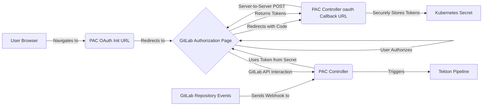

# pac-gitlab-oauth-poc

Proof of concept for GitLab OAuth integration in Pipelines as Code (PAC).

## Design Proposal: GitLab Token-less Integration for Pipelines as Code

### 1. Problem Statement

Currently, integrating Pipelines as Code (PAC) with GitLab requires users to create and manage Personal or Project Access Tokens (PATs). This presents several inconveniences:

* **Manual Token Creation:** Users must navigate GitLab settings to generate tokens.  
* **Token Rotation:** PATs have expiry dates (max 1 year), requiring periodic manual rotation.  
* **Security Concerns:** PATs can have broad scopes, increasing risk if compromised.  
* **Inconsistent Experience:** Differs from GitHub’s App model, which is more seamless and token-less.

**Goal:** Eliminate end-user PAT management for GitLab PAC integration, aiming for a UX similar to GitHub Apps.

### 2. Goals

* Enable PAC to interact with GitLab repositories (statuses, MR comments, fetch `.tekton` files) without user-generated PATs.  
* Use a more secure, manageable auth mechanism (OAuth).  
* Streamline onboarding for GitLab users.  
* Reduce manual token rotation overhead.

### 3. Proposed Solution

Use **GitLab OAuth Applications** to obtain delegated, short-lived access tokens and refresh tokens. PAC will manage these tokens programmatically.

### 4. Architecture and Components



## Usage

1. **Set Environment Variables**

   Export the following before running the server (replace placeholders):

   ```bash
   export FLASK_SECRET_KEY="your_flask_secret"
   export GITLAB_CLIENT_ID="<your_gitlab_oauth_app_client_id>"
   export GITLAB_CLIENT_SECRET="<your_gitlab_oauth_app_client_secret>"
   export GITLAB_REDIRECT_URI="http://localhost:8080/callback/gitlab"
   export GITLAB_URL="https://gitlab.com"  # or your GitLab instance URL
   ```

2. **Install Dependencies**

   ```bash
   pip install flask requests
   ```

3. **Run the POC Server**

   ```bash
   python oauth/server.py
   ```

4. **Initiate OAuth Flow**

   Open your browser and navigate to:

   ```
   http://localhost:8080/oauth/<namespace>/<repository>
   ```

   Replace `<namespace>` and `<repository>` with your project details.

5. **Authorize and Callback**

   After authorizing the app in GitLab, you will be redirected to the callback endpoint, and the JSON response will display the obtained tokens and authorized context.

6. **Webhook Testing**

   To see catch-all logging, send any other request or a webhook payload to `http://localhost:8080/<path>`:

   ```bash
   curl -X POST http://localhost:8080/test/webhook -H "Content-Type: application/json" -d '{"event": "test"}'
   ```

   The server will log request details and return them in the JSON response.
